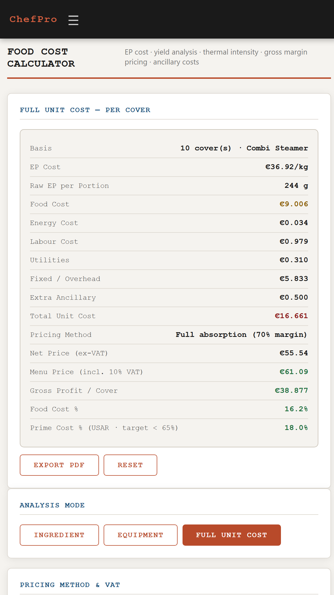
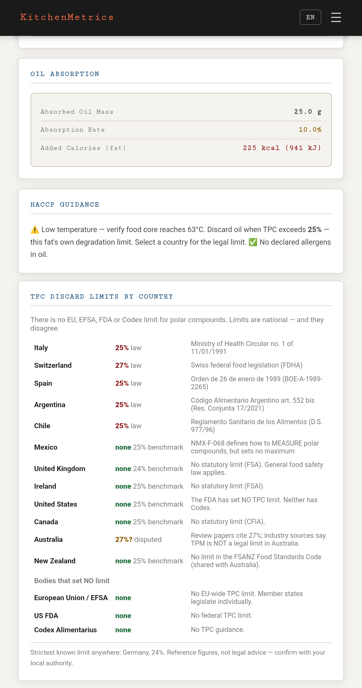
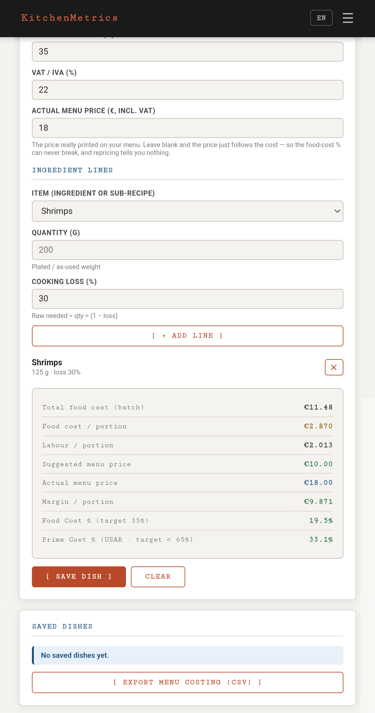
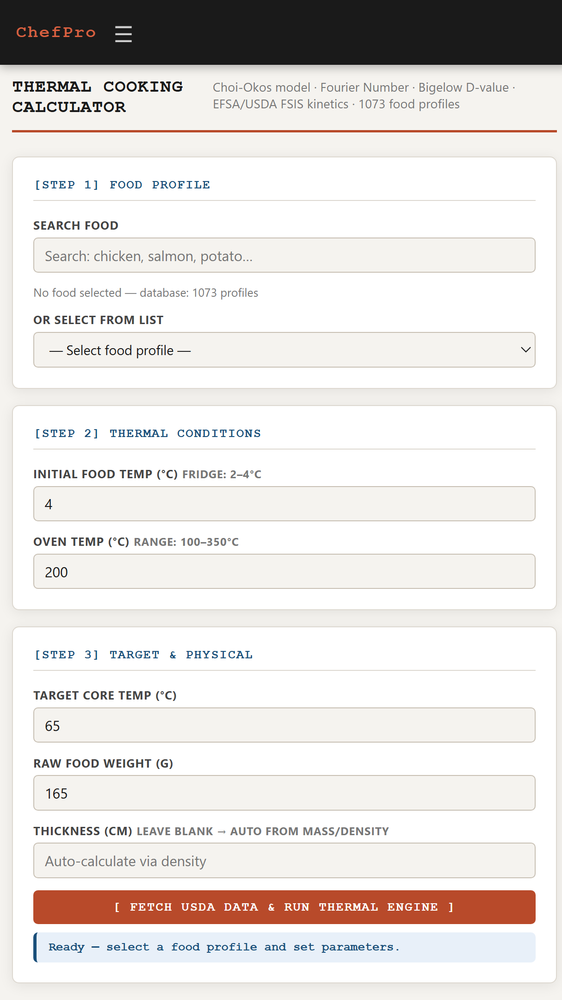
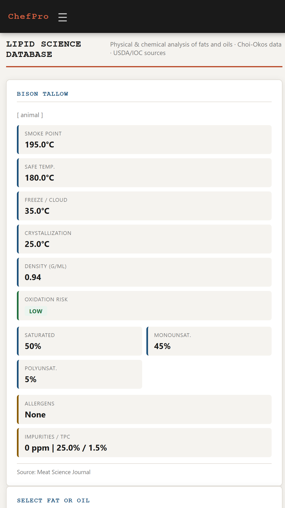

<p align="center">
  
</p>

<h1 align="center">KitchenMetrics — Professional Cooking Suite</h1>

<p align="center">
  Food costing, frying safety and cooking-time science for professional kitchens.<br>
  Works fully offline · No accounts · No ads · No tracking · English / Italiano / Español
</p>

---

## What it does

| | |
|---|---|
| **Recipes & Menu Costing** | Ingredient library with supplier prices and price history. Multi-line dishes, sub-recipes, saved dish library, and menu-wide repricing: *"salmon went up 12% — which dishes break?"* |
| **Food Cost Calculator** | EP cost, energy, labour, utilities, overhead and VAT. Reports **Food Cost %** and **Prime Cost %** against net revenue. |
| **HACCP Fryer Analyzer** | TPC degradation, oil absorption and remaining oil life against the discard limit of the country you cook in — there is no EU, EFSA, FDA or Codex limit for polar compounds, and the national ones disagree (Italy and Spain 25%, Switzerland 27%, no legal limit at all in the UK, Ireland, the USA or Canada). |
| **Thermal Cooking Calculator** | Ramp and hold times from the Choi-Okos model and Bigelow pathogen kinetics, 6-log reduction, 1107 food profiles. |
| **Lipid Science Database** | 148 fats and oils: smoke point, safe temperature, crystallisation, density, fatty-acid profile, oxidation risk, allergens. |
| **Physical Screen Ruler** | DPI-calibrated ruler in cm and inches. |

<p align="center">
  
  
  
  
  
</p>

---

## The costing model

KitchenMetrics follows the **Uniform System of Accounts for Restaurants (USAR)**, the standard
published by the National Restaurant Association.

**Two yields, applied in sequence.** Conflating them undercosts every cooked item:

```
EP €/kg      = AP €/kg ÷ (butchering yield %  / 100)     # trim, bone, peel
raw g needed = plated g ÷ (1 − cooking loss % / 100)     # evaporation, rendering
food cost    = EP €/kg × (raw g ÷ 1000)
```

A 200 g plated salmon portion at 65% butchering yield and 18% cooking loss needs
**244 g of EP fish**, not 200 g.

**Ratios are measured on net revenue** — VAT is collected for the state, not earned:

```
Food Cost %  = food cost       ÷ net price × 100
Prime Cost % = (food + labour) ÷ net price × 100      # USAR headline · target < 65%
```

**Repricing works against your real menu price.** If a price is only ever *derived* from a
target food cost, the ratio equals the target by construction and can never break. KitchenMetrics
stores the price actually printed on your menu, so a supplier increase shows the true margin
hit — and the price you'd need to recover it.

---

## Honest limitations

- The energy **load factor defaults to 0.45 — an estimate, not a measurement.** It is the one
  number in the app not grounded in a published source. Measure yours with a plug meter.
- KitchenMetrics is a professional **estimation** tool. Always verify critical food-safety parameters
  against your own HACCP plan and local regulations.

---

## Sources

USDA FoodData Central · USDA FSIS 9 CFR 318/381 · EFSA BIOHAZ Panel · FDA Food Code 2022 ·
EU 853/2004 · Choi-Okos thermophysical model · Bigelow pathogen kinetics · International Olive
Council · AOCS Lipid Library · Uniform System of Accounts for Restaurants · national TPC
regulations (see **[SOURCES.md](SOURCES.md)** for the full per-figure mapping)

---

## Privacy

No data collection, no analytics, no advertising, no accounts. The app requests **zero
Android permissions — not even INTERNET** — so nothing you type can leave your device:
the guarantee is enforced by the operating system, not promised by a policy.

**[Privacy Policy](privacy-policy.html)**

---

## Sources & verification

**[SOURCES.md](SOURCES.md)** maps every figure the app prints to its published origin —
national regulations for the fryer limits, USDA/IOC/AOCS and peer-reviewed literature for the
fat database, Choi–Okos and Bigelow for the thermal model, USAR for the costing — plus an
honest list of what is *estimated* rather than sourced. Verify anything; don't take our word.

## For developers

- **[Changelog](CHANGELOG.md)** — what shipped in 1.0, and what has changed since. Most entries are
  corrections, recorded with the reason: a correction without its reason teaches nobody anything.
- **[Developer Brief — EN + IT](DEV-BRIEF.md)** — architecture, domain models, test strategy,
  and the journey from a Python exercise to a signed Play release in two and a half months.
- **[Engineering Notes](TECHNICAL.md)** — case study of the highest-severity bug found in the
  pre-release audit (a thermal model wrong in the dangerous direction) and how it was caught.

---

<p align="center"><sub>
  This repository hosts the documentation, privacy policy and release notes.<br>
  The application source is maintained privately.
</sub></p>
